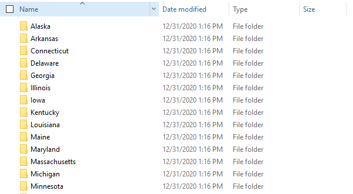
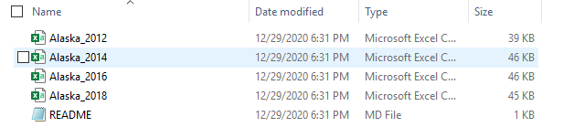

```{r fig.align='center', fig.height=6, fig.width=6, message=FALSE, warning=FALSE, include=FALSE}
# Set our plot specifications for the rest of the document.
knitr::opts_chunk$set(fig.width = 9, 
                      fig.height = 6, 
                      fig.align = "center",
                      # Set our code specifications for the rest of the document
                      warning = F,
                      message = F)
```
  

```{r set-up_and_clean_data, include=FALSE}
###########################################################################
## Set Up -----------------------------------------------------------------
###########################################################################
# Bring in packages
suppressMessages(library("pacman"))

pacman::p_load(tidyverse, # Used for data wrangling,
               here, # Where in the world are we?
               stringr,
               pander, # Pretty printing
               readr, # Used for working with files,
               praise, # Used for positive reinforcement,
               kableExtra, # Used for RMarkdown formatting
               stringi)
```

The purpose of this script is to load and clean all of the various *.csv* files containing polling place data into R. The data, which is available for download **[here](https://publicintegrity.org/politics/elections/ballotboxbarriers/data-release-sheds-light-on-past-polling-place-changes)**, is structured as follows:  
 - Each state (32 in total) has its own folder  
 - Within each state (folder), there are a variable number of CSV files, one for each year that polling place data is available
 
Here is what the folder structure looks like:  



Here is one example of the datasets that could be contained in a folder:  



Generally, my approach to reading in these data files into 1 R Dataframe is to:  
  0. Initialize an empty dataframe to hold the results  
  1. Loop through each state folder  
  2. Determine the CSVs within that state folder  


As a precautionary measure, let's determine how many state folders there are. We'll assume that any object in our working directory that does NOT end in *.csv* is a state folder. Because there's no direct regex to look for "un-matches", let's find the set difference between all of our files and those ending in *.csv*.
```{r determine_folders, include = TRUE}
# Determine the different state folders in our dataset and remove any already existing csv files
all_files <- list.files(here("Data/Polling-Places-Data/"))
csv_files <- list.files(here("Data/Polling-Places-Data/"), pattern = ".csv$")
(states <- setdiff(all_files, csv_files))
```

## 0. Initialize an Empty Dataframe  
Next, we'll set up the structure for our dataframe. These are the columns and associated data types for each column that we expect to get.
```{r empty_df, echo=TRUE}
polling_places <- data.frame(state_name = character(),
                             state = character(),
                             election_date = as.Date(character()),
                             jurisdiction_type = character(),
                             jurisdiction = character(),
                             county_name = character(),
                             precinct_name = character(),
                             precinct_id = character(),
                             polling_place_type = character(),
                             municipality = character(),
                             name = character(),
                             address = character(),
                             year = double(),
                             stringsAsFactors=FALSE)
```

## 1. Read in Data  
In this next section, which constitutes the major lift for reading in the data, we will:  
  1. **Loop through each of the state folders** we discovered earlier (outer loop) and determine the number of files in the folder  
  2. **Loop through each of the *.csv* files** (inner loop) to:  
    3a. Determine if it's a *.csv*  
    3b. If it is, read it in as a temporary dataframe  
  3. Create two new columns in the temporary dataframe:  
      - state_name <- same as the folder name in the outer loop  
      - year <- same as the year that appears in the name of the file  
  4. Append (union) the temporary dataframe created in Step 3 to the empty, initialized dataframe from earlier  
  

### 1.1 Loop through State Folders  
First, we start with the outer loop, which goes through all of the state folders, as defined above. Once in each state folder, we'll identify all of the files that exist within it (usually a few *.csv* files and one *.md* file).
```{r outer_loop, echo = T, results = 'hide', eval = F}
for (state_ in states) {
  # Within each data folder, there are multiple .csv files, one for each election. Let's pull out each of these files
  state_contents <- list.files(paste(here("Data/Polling-Places-Data/"), state_, sep = "/"))
```

### 1.2 Loop through CSV Files  
Next, let's loop through each of the states to read our .csv files in. Remember that in this step we will:  
- Determine if the file is *.csv* (otherwise, it's *.md*)  
- Determine the name of the file (a combination of our file path, the state name from the outer loop, and the value from the inner loop)  
- Read the file in as a temporary dataframe

```{r inner_loop, echo = T, results = 'hide', eval = F}
  for (i in state_contents) {
    # If the file is a csv file, then let's read it in
    if (str_detect(i, ".csv") ) {
      # Find the file path name for the csv
      csv_name <- paste("Data/Polling-Places-Data", state_, i, sep = "/")

      # Let's read in the file as a temporary dataframe
      temp_df <- read_csv(csv_name, col_types = cols(
        .default = col_character(),
        election_date = col_date(format = ""),
        state = col_character(),
        jurisdiction = col_character(),
        county_name = col_character(),
        municipality = col_character(),
        jurisdiction_type = col_character(),
        polling_place_type = col_character(),
        precinct_id = col_character(),
        precinct_name = col_character(),
        name = col_character(),
        address = col_character()
        )
      )

```

### 1.3 Create New Features  
Now that we've read in our dataset, we'll create two new columns in the temporary dataframe:  
 **1. state_name** | From the outer loop  
 **2. year** | From the name of the csv (also available as the iterator, *i*)  

```{r new_features, echo = T, results = 'hide', eval = F}
  # We want the state name from earlier to be brought in as the column
  temp_df <- temp_df %>%
    mutate(state_name = state_,
           year = as.integer(str_extract(i, "\\d+"))
    )
```

### 1.4 Union to Master Dataframe  
Lastly, we'll append the temporary dataframe to our master dataframe using a smart union (bind_rows), which doesn't need all column headers to match.
 
```{r union, echo = T, results = 'hide', eval = F}
  # Lastly, let's append this to the bottom of our master dataset
  polling_places <- bind_rows(polling_places, temp_df)
```


### Altogether Now!  
What does all of this look like together? Well, here it is:  

```{r read_data}
for (state_ in states) {
  # Within each data folder, there are multiple .csv files, one for each election. Let's pull out each of these files
  state_contents <- list.files(paste(here("Data/Polling-Places-Data/"), state_, sep = "/"))

  # Let's loop through each of the states to read and add our .csv files in
  for (i in state_contents) {
    # If the file is a csv file, then let's read it in
    if (str_detect(i, ".csv") ) {
      # print("Parsing...")

      # Find the file path name for the csv
      csv_name <- paste("Data", "Polling-Places-Data", state_, i, sep = "/")

      # Let's read in the file as a temporary dataframe
      temp_df <- read_csv(csv_name, col_types = cols(
        .default = col_character(),
        election_date = col_date(format = ""),
        state = col_character(),
        jurisdiction = col_character(),
        county_name = col_character(),
        municipality = col_character(),
        jurisdiction_type = col_character(),
        polling_place_type = col_character(),
        precinct_id = col_character(),
        precinct_name = col_character(),
        name = col_character(),
        address = col_character()
        )
      )

      # We want the state name from earlier to be brought in as the column
      temp_df <- temp_df %>%
        mutate(state_name = state_,
               year = as.integer(str_extract(i, "\\d+"))
        )

      # Lastly, let's append this to the bottom of our master dataset
      polling_places <- bind_rows(polling_places, temp_df)
    }
  }
  # cat("===========================\n===========================\n")
}

# WE'RE DONE.
cat(praise(), "WE'RE DONE!!!")

```

And that's it! If you run the code above, make sure to uncomment the *print/cat* functions so you can get updates as the code runs. Let's take a look at the final dataset:

```{r view_data_with_kable, echo=FALSE}
# In any kable outputs, display NAs as blanks
opts <- options(knitr.kable.NA = "")

polling_places %>% 
  head(25) %>%
  # Fix up the headers by replacing the underscores with spaces
  # rename_all(funs(str_replace_all(., "_", " "))) %>% 
  mutate_if(is.character, str_replace_all, pattern = "_", replacement = " ") %>% 
  # Make everything proper capitalization
  rename_all(funs(str_to_title)) %>%
  mutate_all(str_to_title) %>%
  kable() %>%
  kable_styling(bootstrap_options = c("striped", "hover"), 
                full_width = F,
                font_size = 10) %>%
  # Make the header row bold and black so it's easier to read
  row_spec(0, bold = T, color = "black") %>% 
  scroll_box(height = "400px", width = "100%")
  # pander()
```

Looks great!

## Alternative Methods  
It shouldn't go without saying that this is not the only way to read in multiple data files from different folders! More experienced R users usually use techniques from the purrr package (i.e. *map()* function) to more efficiently (in terms of time *and* lines of code) perform the same task as above. While the purrr package does provide much facility and readability in code, I usually prefer to write out the process using *for loops*, as it allows me to better understand what's happening "under the hood". 


*Article also available here:*  
*https://jschulberg.medium.com/reading-multiple-csvs-into-merged-r-dataframe-fe745d9e5b78*